# Play Q.I.

Play Q.I. est un site qui permet de tester ses connaissances tout en s'amusant.

Il contient 24 quiz répartis en 9 catégories :
- Animaux
- Art
- Cinéma
- Culture
- Gastronomie
- Géographie
- Histoire
- Insolite
- Sciences

J'ai défini les thèmes, les questions et les réponses associées. 

Tout le monde peut accéder aux quiz et parcourir les questions et les réponses possibles. Pour jouer, il faut créer un compte et se connecter. Quand c'est fait, l'utilisateur répond aux questions et peut visualiser son score, les réponses qu'il a donné et les explications de chacune des bonnes réponses. 

Les personnes ayant un statut "admin" ont accès aux mêmes fonctionnalités que les utilisateurs et peuvent aussi ajouter ou modifier des sujets de quiz et associer des quiz aux sujets qu'ils souhaitent.

Ce site est responsive.

## Réalisation

J'ai entièrement réalisé ce projet Node.js lors de mon troisième mois de formation en développement web FS JavaScrpt.

Il s'agit du premier projet que je code en POO.

J'ai codé ce projet en 4 jours (de la base de donnée au rendu final).

## Stack
- Node.js
- Express
- Sequelize
- bcrypt
- email-validator
- ejs
- PostgreSQL (avec tables relationnelles)
- Sqitch
 
## Languages utilisés 

- HTML5, CSS3
- JavaScript 
- SQL 
  
 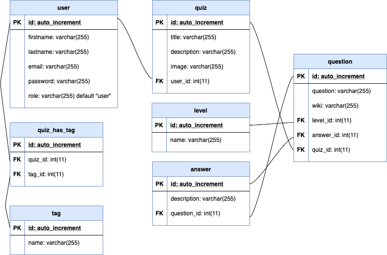

## Screenshots

### Home page
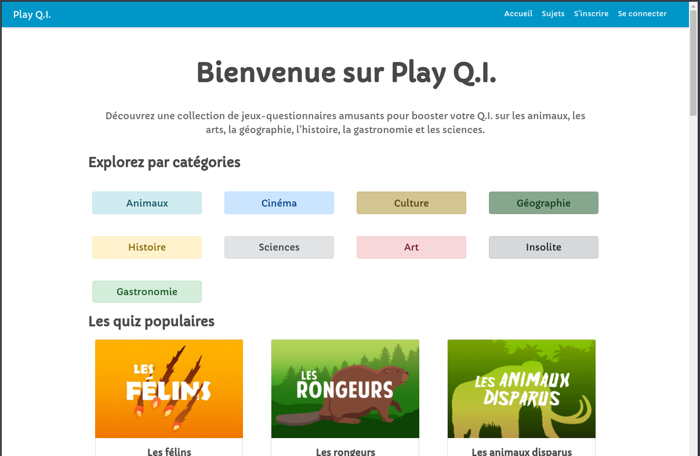

### Tag page
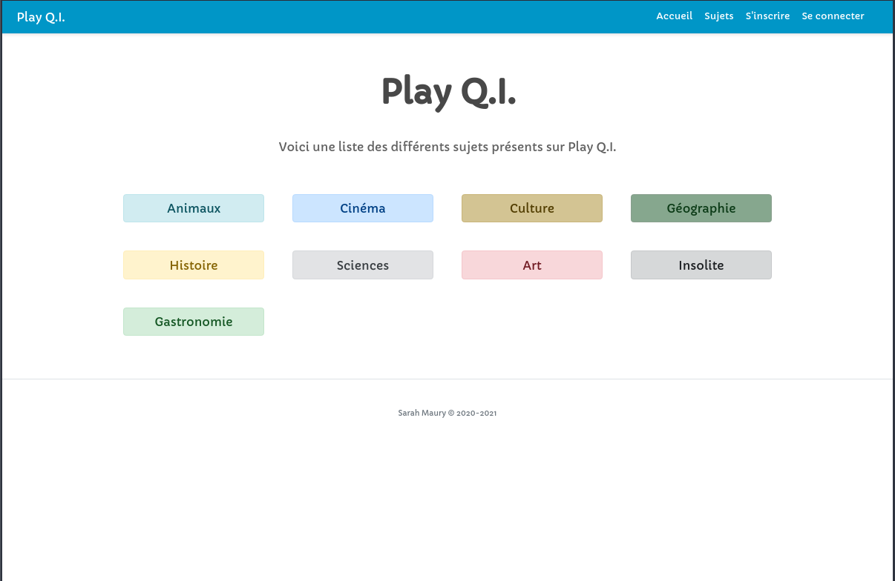

### Liste des quiz
Visible depuis la home page :
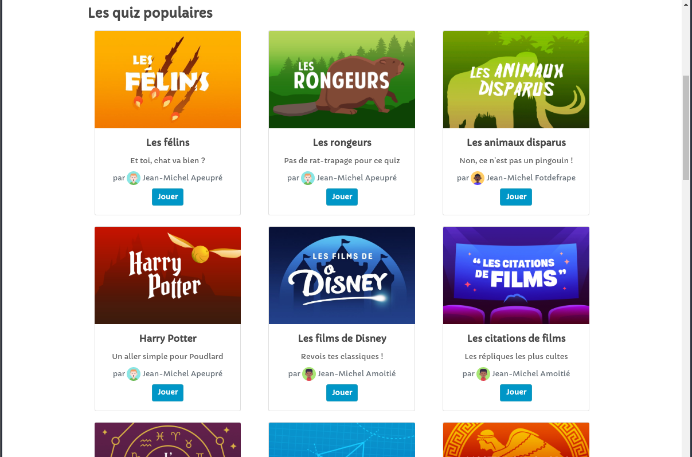

### Quiz page preview
Visible par tout le monde (pas de possibilité de jouer sans se connecter) :
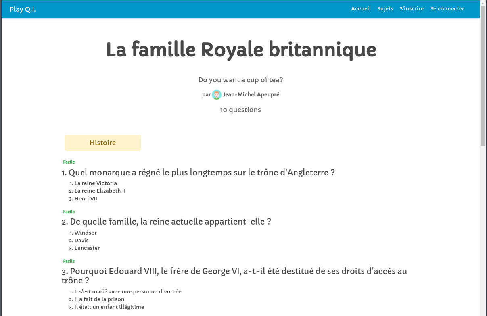

### Sign-up page
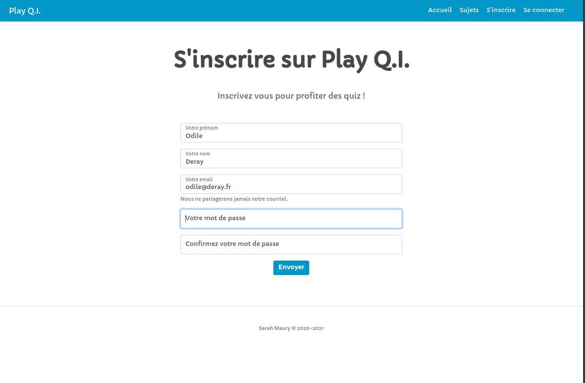

### Sign-in page
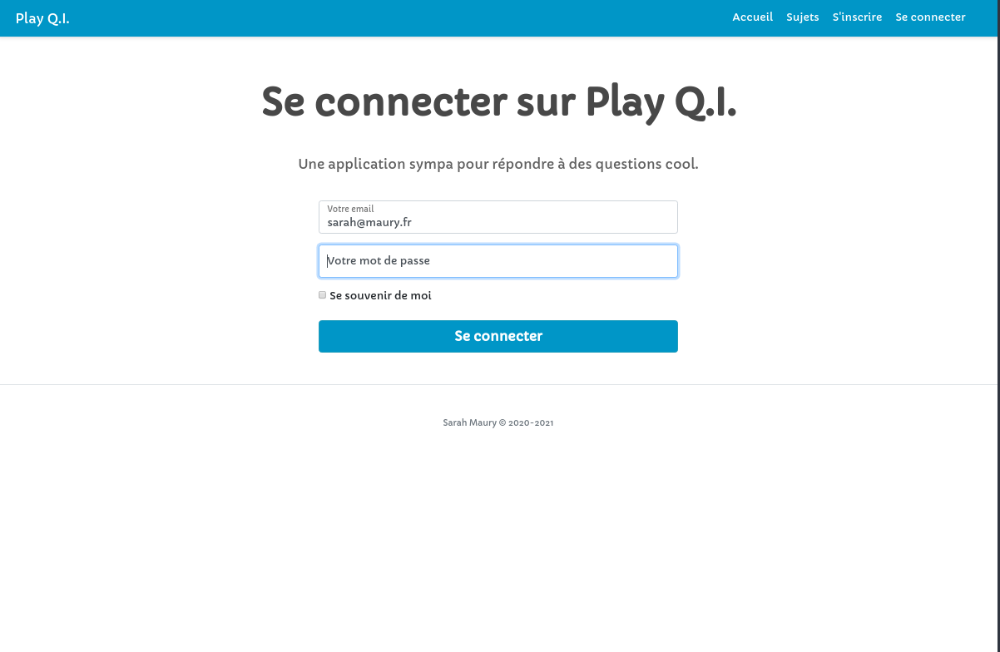

### Profile page
Page disponible uniquement aux personnes qui se sont inscrites :
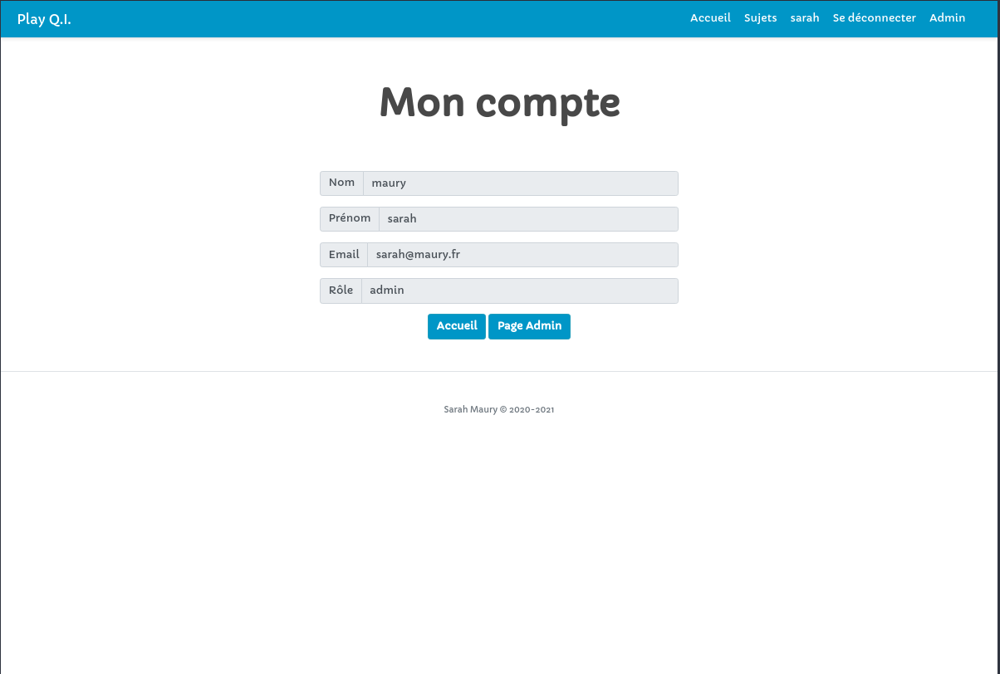

### Play quiz page 
Une fois connecté, l'utilisateur peut répondre aux questions du quiz de son choix :
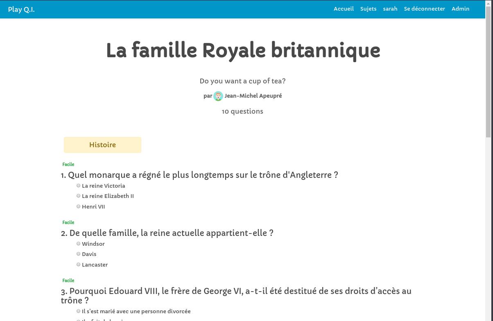

### Result page
Une fois que l'utilisateur a répondu à TOUTES les questions (une seule réponse possible), il peut visualiser son score, les réponses qu'il a donné, les bonnes réponses et leurs explications :
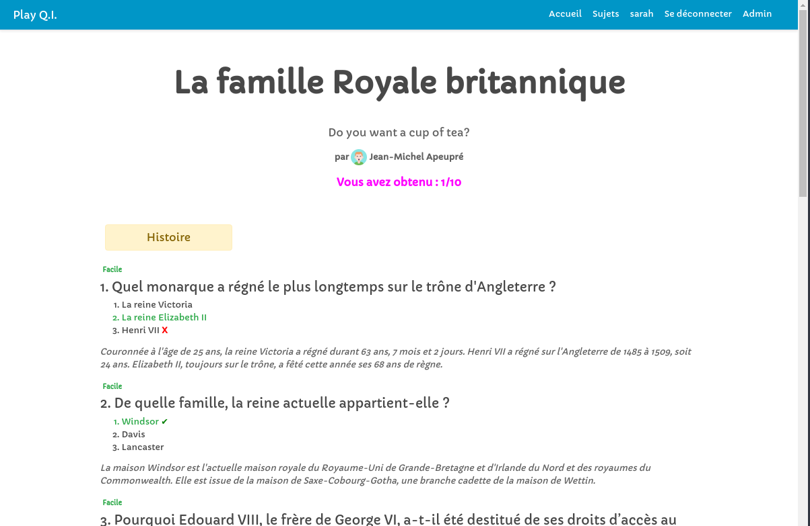

### Admin pages
Page visible seulement par les administrateurs :
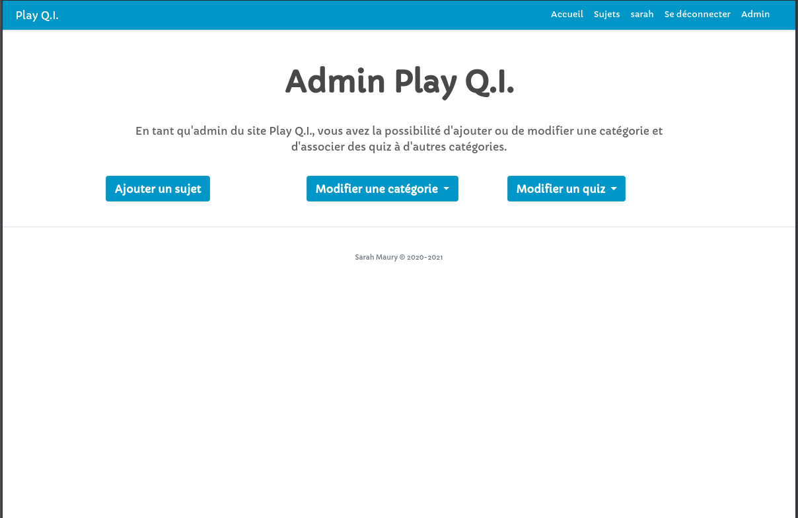

Page pour **ajouter un tag :** 
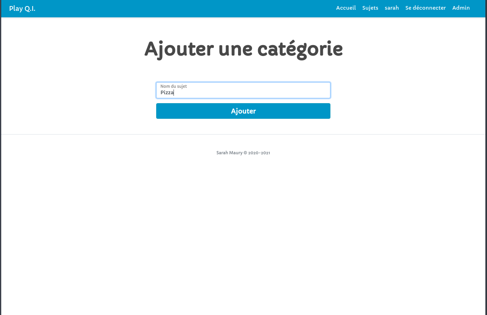

Page pour **modifier un tag :** 
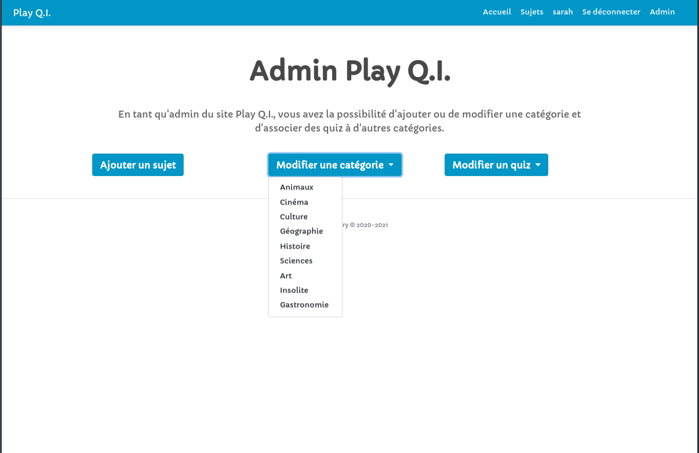

Page pour **associer un tag à un quiz :**
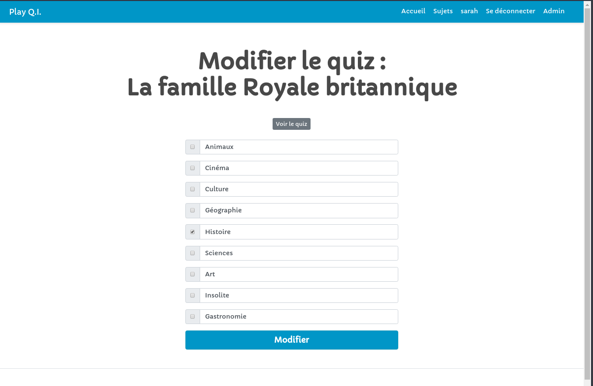

## Installation 

**Pré-requis**
- Node.js pour le télécharger c'est [ici](https://nodejs.org/en/download/)
- PostgreSQL

1. Cloner le repo 
- en utilisant la clé SSH
```
git clone git@github.com:sarah-maau/playQI.git
```
- en utilisant HTTPS
```
git clone https://github.com/sarah-maau/playQI.git
```

2. Installer les dépendances 

```
npm i
```
   
3.  Renommer le fichier `.env.example` en `.env` avec vos variables d'environnement

4.  Créer une base de données

5. Renommer le fichier the sqitch.example.conf to sqitch.conf,puis chargez les tables en utilisant la commande Sqitch :

```
sqitch deploy db:pg:<nom de la base de données>
```

6. Charger les données
   
```
psql -d <nom de la base de données> -f ./data/import_data.sql
```
7. Lancer le script

```
npm start
```
8. Une fois sur la page, pour tester l'application dans son entiereté, créer un utilisateur et se connecter avec les identifiants !

## Licence
Ce projet est sous licence MIT - voir le fichier `LICENSE` pour plus de détails
