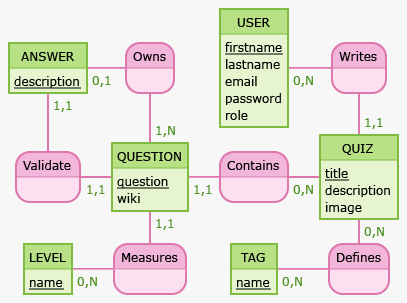

# Conception de la BDD
Méthode MERISE

## Analyse des entités
- Quiz
  - title
  - description
  - image  

- Question
  - question
  - wiki
  
- Answer
  - description

- User
  - firstname
  - lastname
  - email
  - password
  - role

- Tag
  - name

- Level
  - name

## Analyse des associations entre entité
### User <-> Quiz  
Un User est l'auteur d'un Quizz

- verbe: writes
- relation de type `1:N`  
  - User > Quiz: un User écrit 0 Quiz au min, et N Quiz au max
  - Quiz > User: un Quiz peut être écrit par 1 User (auteur) au min, et 1 User au max

### Question <-> Quiz
Un Quiz contient des Question

- verbe: contains
- relation de type `1:N`
  - Question > Quiz: une Question est contenue dans 1 Quiz au min, et 1 Quiz au max
  - Quiz > Question: un Quiz contient 0 Question au min et N au max

### Tag <-> Quiz
Un Tag défini un Quiz

- verbe: defines
- relation de type `N:N`
  - Tag > Quiz: un Tag définit 0 Quiz au min et N au max
  - Quiz > Tag: un Quiz est défini par 0 Tag au min et N au max

### Question <-> Level
Un Level jauge une Question

- verbe: measures
- relation de type `1:N`
  - Level > Question: un Level jauge 0 Question au min et N au max
Question > Level: une Question est jaugée par 1 
  - Level au min et 1 au max

### Question <-> Answer
/!\ il existe ici 2 associations entre ces entités

Une Question détient une Answer possible

- verbe: owns
- relation de type `1:N`
  - Question > Answer: une Question détient 1 Answer possibles au min et N au max
  - Answer > Question: une Answer possible est détenue par 0 Question au min et 1 au max
pour la bonne réponse

Un Answer valide une Question

- verbe: validates
- relation de type `1:1`
  - Question > Answer: une Question est validée par 1 Answer au min et 1 au max
  - Answer > Question: une Answer valide 1 Question au min et 1 au max

## MCD

## MLD
